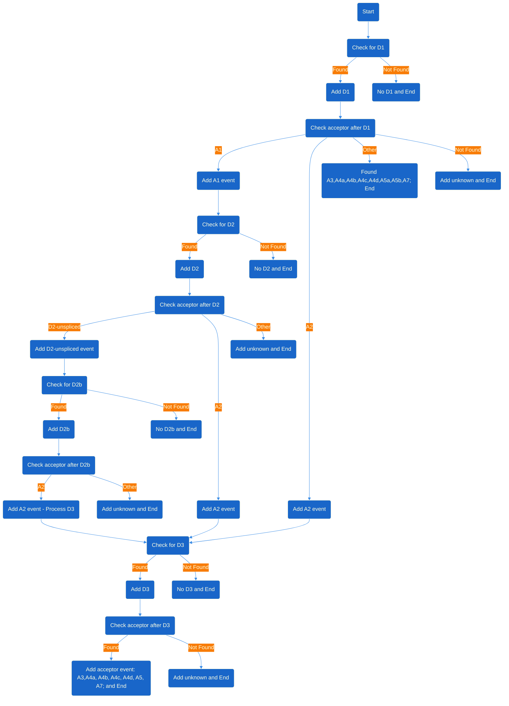

# HIV Splicing analysis

Rust App to analyze NGS data to detect HIV splice forms.

## Splice Event Idenfitication Workflow

```mermaid

%%{
  init: {
    'theme': 'base',
    'themeVariables': {
      'primaryColor': '#1966C9',
      'primaryTextColor': '#FEFFE2',
      'primaryBorderColor': '#FEFFE2',
      'lineColor': '#3A8CE5',
      'secondaryColor': '#F87C07',
      'tertiaryColor': '#FF8BA0'
    }
  }
}%%


flowchart TD
    A(Start) --> B(Check for D1)
    B -- Found --> C(Add D1)
    B -- Not Found --> End1(No D1 and End)

    C --> D(Check acceptor after D1)
    D -- A1 --> E(Add A1 event)
    D -- A2 --> F(Add A2 event)
    D -- Other --> End2(Found A3,A4a,A4b,A4c,A4d,A5a,A5b,A7; End)
    D -- Not Found --> End3(Add unknown and End)

    E --> G(Check for D2)
    G -- Found --> H(Add D2)
    G -- Not Found --> End4(No D2 and End)

    H --> I(Check acceptor after D2)
    I -- D2-unspliced --> J(Add D2-unspliced event)
    I -- A2 --> K(Add A2 event)
    I -- Other --> End5(Add unknown and End)

    J --> L(Check for D2b)
    L -- Found --> M(Add D2b)
    L -- Not Found --> End6(No D2b and End)

    M --> N(Check acceptor after D2b)
    N -- A2 --> O(Add A2 event - Process D3)
    N -- Other --> End7(Add unknown and End)

    %% Convergence to the D3 branch:
    K --> P(Check for D3)
    F --> P
    O --> P

    P -- Found --> Q(Add D3)
    P -- Not Found --> End8(No D3 and End)

    Q --> R(Check acceptor after D3 )
    R -- Found --> End9(Add acceptor event: A3,A4a, A4b, A4c, A4d, A5, A7; and End)
    R -- Not Found --> End10(Add unknown and End)


```
