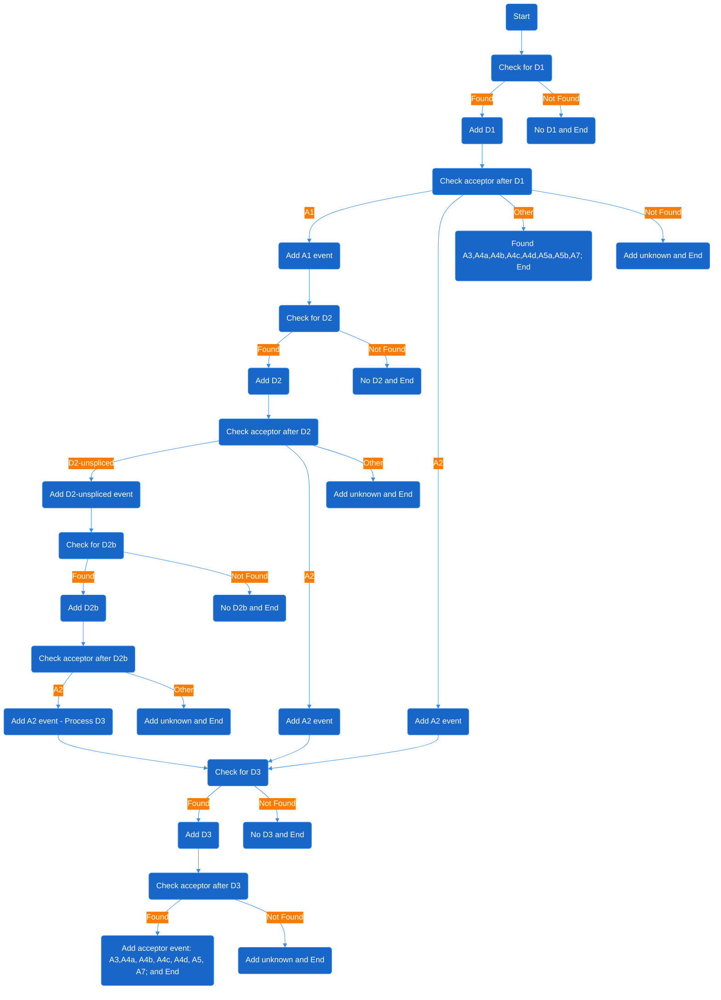

# HIV Splicing analysis


**viRust-splicing** is a high-performance command-line program written in Rust for analyzing HIV-1 splicing patterns from UMI/Primer-ID–based next-generation sequencing (NGS) data.

It parses paired-end FASTQ/FASTA files (also supports .gz files), maps donor–acceptor sites, quantifies splice isoforms, and generates structured outputs suitable for downstream statistical analysis and visualization.

## Key Features

- ⚡ Ultra-fast processing using Rust parallelism (Rayon)

- 🧬 UMI/Primer-ID aware read deduplication and merging

- 🧭 Donor/acceptor mapping to HXB2 reference coordinates

- 📊 Isoform quantification and junction usage statistics

- 🪄 TSV/CSV/JSON output for downstream R/Python/Quarto visualization

- 🧰 Seamless integration with Plotly, ggplot2, and D3.js

- 🌐 Self-contained HTML report with downloadable data.

## Installation

1. From GitHub (lastest dev)

```bash
git clone https://github.com/ViralSeq/viRust-splicing.git
cd viRusts-splicing
cargo build --release
./target/release/virust-splicing
```

### Dependencies:

- Rust ≥ 1.7.5

- R(≥ 4.0.0) Python3 and Quarto are required for report generation.

## Usage

```
Usage: virust-splicing [OPTIONS] --query <QUERY> --distance <DISTANCE> --file1 <FILENAME_R1> --file2 <FILENAME_R2> --assay <ASSAY_TYPE>

Options:
  -q, --query <QUERY>
  -d, --distance <DISTANCE>
  -u, --umi <UMI_FAMILY_MODEL>  [default: max-model] [possible values: max-model, cluster-model, cluster-model-plusone, auto-model]
      --umiMinFraction <UMI_MIN_FRACTION>  [default: 0.005]
      --umiAutoNeighborRisk <UMI_AUTO_NEIGHBOR_RISK>  [default: 0.05]
      --headerMatch <HEADER_MATCH>
  -1, --file1 <FILENAME_R1>
  -2, --file2 <FILENAME_R2>
  -a, --assay <ASSAY_TYPE>    [possible values: random-reverse, k-mer, size-specific]
  -o, --output <OUTPUT_PATH>
  -h, --help                  Print help
  -V, --version               Print version

```

## Example usage

### Run from repo

```bash
cargo run --release -- --query nl43 --distance 1 --assay random-reverse --file1 ./sample_data/mock_data_r1.fasta.gz --file2 ./sample_data/mock_data_r2.fasta.gz -o ./
```

### UMI family models

The `--umi` option defines UMI families independently within each `final_category`. The default
is `max-model`; the available values are `max-model`, `cluster-model`,
`cluster-model-plusone`, and `auto-model`.

#### Max model

`max-model` is an exact-UMI, conservative approach. It counts every distinct UMI in a category,
finds the most abundant UMI, and uses that maximum count to select a simulation-derived frequency
cutoff. Exact UMIs must have a count strictly above that cutoff to be retained as families. The
underlying simulation asked at what count low-frequency UMI variants can no longer be reliably
distinguished from offspring of an abundant parent UMI. This makes the model deliberately
conservative: it does not merge similar UMI sequences and it may discard sparse, singleton-heavy
categories.

The approach was evaluated using serial dilution of input template RNA. With `max-model`, UMI
family size showed a strong linear correlation with input-template number, supporting its use when
the category has sufficient UMI coverage. The underlying Primer ID study is: Zhou S, Jones C,
Mieczkowski P, Swanstrom R. _Primer ID Validates Template Sampling Depth and Greatly Reduces the
Error Rate of Next-Generation Sequencing of HIV-1 Genomic RNA Populations._ Journal of Virology
89(16):8540-8555 (2015). [doi:10.1128/JVI.00522-15](https://doi.org/10.1128/JVI.00522-15).

#### Cluster models

`cluster-model` groups equal-length UMIs that differ by no more than `--distance` substitutions.
`cluster-model-plusone` allows `--distance + 1` substitutions. Families are named after their most
frequent UMI; ties use lexical order. Every assigned UMI must be directly within the model's
mismatch threshold of its family parent, so similar UMIs cannot form a transitive chain into one
oversized family.

#### Auto model

Use `--umi auto-model` to choose `max-model` or `cluster-model` independently for each
`final_category`. Auto mode first calculates the unique-UMI fraction:

$$
\text{unique\_umi\_fraction} =
\frac{\text{distinct\_umis}}
{\text{reads\_in\_final\_category}}
$$

When that fraction is at most `0.10`, auto mode selects `max-model`: on average, each distinct UMI
has at least 10 reads of coverage. For sparser categories, it estimates the expected number of
random, unrelated UMI neighbors within the clustering radius (`lambda`):

$$
\lambda = \frac{(N_{\mathrm{UMI}} - 1)\,N_{\mathrm{neighbor}}}
{4^{L} - 1},
$$

where

$$
N_{\mathrm{neighbor}} =
\sum_{k=1}^{d}
\binom{L}{k}3^k,
$$

with

- $L$: UMI length
- $d$: maximum mismatch distance
- $N_{\mathrm{UMI}}$: number of distinct UMIs of length $L$

The calculation is performed separately for each observed UMI length, and the largest lambda is
used for the category. Auto mode selects `max-model` when lambda is greater than or equal to
`--umiAutoNeighborRisk` (default `0.05`); otherwise it selects ordinary `cluster-model` using
`--distance`. A lambda of `0.05` corresponds to about a 4.9% chance that a random UMI has at
least one unrelated neighbor inside the clustering radius. This protects large singleton-heavy
UMI pools from accidental similarity while allowing small sparse categories to retain information.

For safety, auto mode selects `max-model` when a UMI contains a base other than `A`, `C`, `G`, or
`T`, because the random-neighbor calculation assumes a four-base UMI alphabet. The selected model
and per-category diagnostics are written to the output TSV as `umi_model_used`,
`umi_unique_count`, `umi_unique_fraction`, and `umi_neighbor_risk`.

For either cluster model, `--umiMinFraction` sets the minimum family fraction within each
`final_category`; it defaults to `0.005` (0.5%). The threshold is
`ceil(umiMinFraction * reads_in_final_category)`, so shallow categories can retain singleton
families. This option does not affect `max-model`.

The output TSV reports `umi_family_size` and `umi_family_fraction` for each retained family,
plus the actual `umi_model_used`, `umi_unique_count`, `umi_unique_fraction`, and
`umi_neighbor_risk` for its `final_category`.

Use `--headerMatch <IUPAC sequence>` to retain pairs whose R1 prefix matches the supplied
pattern with up to `--distance` mismatches. Matching starts at R1 base 1 and includes the first
four forward bases (`forward_ns`), which may contain an R1 UMI. IUPAC degenerate codes such as
`R`, `Y`, and `N` are supported; use `N` at UMI positions when any nucleotide should match.

For example, `--headerMatch NNNNACGTR` ignores the first four R1 UMI bases and then requires the
following five bases to match the IUPAC pattern `ACGTR`.

### Run using binary

```bash
./virust-splicing -q nl43 -d 1 -a random-reverse -1 ./sample_data/mock_data_r1.fasta.gz -2 ./sample_data/mock_data_r2.fasta.gz -o ./
```

<small>Note that inputs use '-' instead of '\_' , use assay "random-reverse" instead of "random_reverse"</small>

### Example Output

```
results/
 ├─ output_strain_nl43_distance_1_assay_random-reverse.tsv
 ├─ output_strain_nl43_distance_1_assay_random-reverse_summary.csv
 ├─ report.html
 └─ report.qmd
```

## Benchmark & Performance

    •	Processes 10M+ reads in minutes using multi-threading
    •	Memory efficient (<2 GB typical usage)
    •	Scales linearly with read count and cores

## Biological Context

HIV-1 relies on extensive alternative splicing to generate over 40 mRNAs. This tool identifies splice junction usage from NGS data, enabling:

- Quantification of donor–acceptor site usage (D1→A1–A7, D2→A3–A7, etc.)

- Detection of cryptic junctions

- Longitudinal splicing dynamics analysis

## Contributing

We welcome pull requests and bug reports!

    1.	Fork the repo
    2.	Create a feature branch (git checkout -b feature/foo)
    3.	Commit and push
    4.	Open a PR

## License

This project is licensed under the MIT License. [MIT License](https://opensource.org/licenses/MIT).

## Achnowledgements

- NIH/NIAID for funding support.

- Center for Structural Biology of HIV RNA (CRNA) (U54 AI170660-01)

- UNC Center for AIDS Research (CFAR) (P30 AI050410)

- Dr. Ann Emery

## Splice Event Idenfitication Workflow


