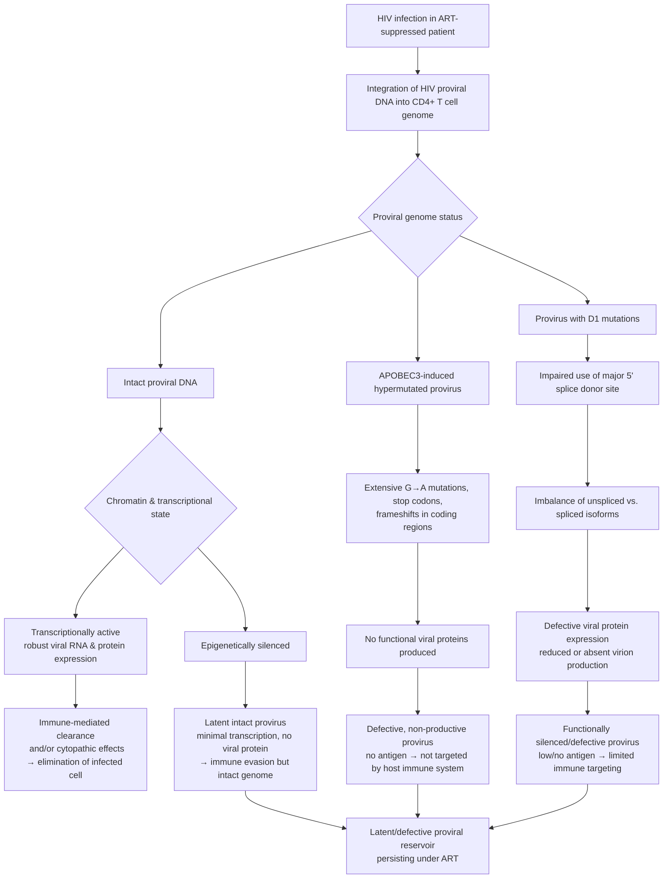

```mermaid
flowchart TD
    A[HIV infection in ART-suppressed patient] --> B[Integration of HIV proviral DNA into CD4+ T cell genome]

    B --> C{Proviral genome status}

    %% Branch 1: Intact proviral DNA
    C --> D[Intact proviral DNA]
    D --> G{Chromatin & transcriptional state}

    G --> H[Transcriptionally active<br/>robust viral RNA & protein expression]
    H --> I[Immune-mediated clearance<br/> and/or cytopathic effects<br/>→ elimination of infected cell]

    G --> J[Epigenetically silenced<br/>]
    J --> K[Latent intact provirus<br/>minimal transcription, no viral protein<br/>→ immune evasion but intact genome]

    %% Branch 2: APOBEC hypermutation
    C --> E[APOBEC3-induced hypermutated provirus]
    E --> L[Extensive G→A mutations, stop codons,<br/>frameshifts in coding regions]
    L --> M[No functional viral proteins produced]
    M --> N[Defective, non-productive provirus<br/>no antigen → not targeted by host immune system]

    %% Branch 3: D1 splice donor mutations
    C --> F[Provirus with D1 mutations]
    F --> O[Impaired use of major 5' splice donor site]
    O --> P[Imbalance of unspliced vs. spliced isoforms<br/>]
    P --> Q[Defective viral protein expression<br/>reduced or absent virion production]
    Q --> R[Functionally silenced/defective provirus<br/>low/no antigen → limited immune targeting]

    %% Reservoir outcome under ART
    K --> S[Latent/defective reservoir under ART]
    N --> S
    R --> S

    S[Latent/defective proviral reservoir<br/>persisting under ART<br/>]
```
